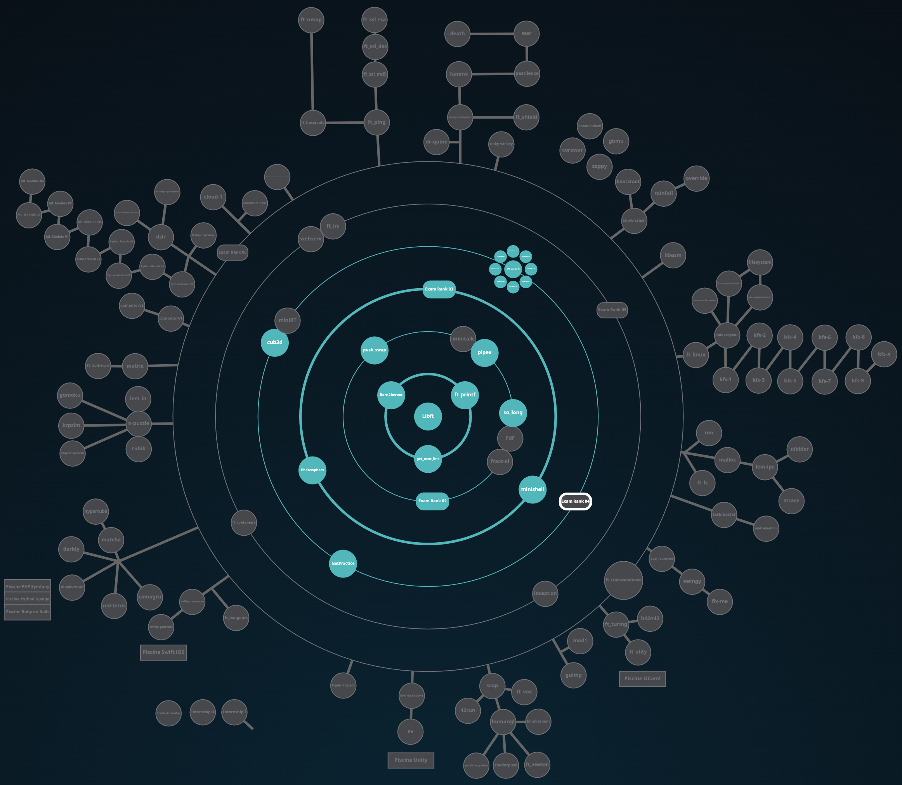

# 1337 - 42 NETWORK

## HolyGraph

## INFO
***CLASS OF 01/11/2021 (4th promo)***

## PROJECTS

### COMMON CORE

(***! some projects can't be uploaded due to there nature [virtual machine - networking - ... ]***)

(***! some projects only has 100 as max score***)

| CIRCLE  | NAME | FIELD | EXPECTED DURATION | EXP | STATUS | LVL |
| :-: | :-: | :-: | :-: | :-: | :-: | :-: |
| 0 | [libft](./lvl_0/libft) | C | 70 hours | 462 |  | 1.06 |
| 1 | [get next line](./lvl_1/get_next_line) | C | 70 hours | 882 | | 1.57 |
| 1 | [ft_printf](./lvl_1/ft_printf) | C | 175 hours | 882 | | 2.06 |
| 1 | Born2beRoot | Virtual Machine | 40 hours | 577 | | 2.29 |
| 2 | [push_swap](./lvl_2/push_swap) | C | 60 hours | 1855 |  | 3.02 |
| 2 | [so_long](./lvl_2/so_long) | C | 60 hours | 1000 |  | 3.25 |
| 2 | [pipex](./lvl_2/pipex) | C | 50 hours | 1142 |  | 3.50 |
| 3 | [philosophers](./lvl_3/philosophers) | C | 70 hours | 3360 |  | 4.08 |
| 3 | [minishell](./lvl_3/minishell) | C | 210 hours | 2814 |  | 4.29 |
| 4 | NetPractice | Networking | 50 hours | 3160 |  | 4.48 |
| 4 | [cub3D](./lvl_4/Cub3d) | C - mlx | 280 hours | 5775 |  | 4.91 |
| 4 | [CPP Module 08](./lvl_4/cpp_pool) | C++ | (7 * 9) hours | 9660 |  | 5.50 |
| 5 | [ft_containers](./lvl_5/ft_containers) | C++ | 140 hours | 10042 |  | 6.23 |
| 5 | [ft_containers](./lvl_5/inception) | System Administration & Docker | 140 hours | 10042 |  | 6.95 |

