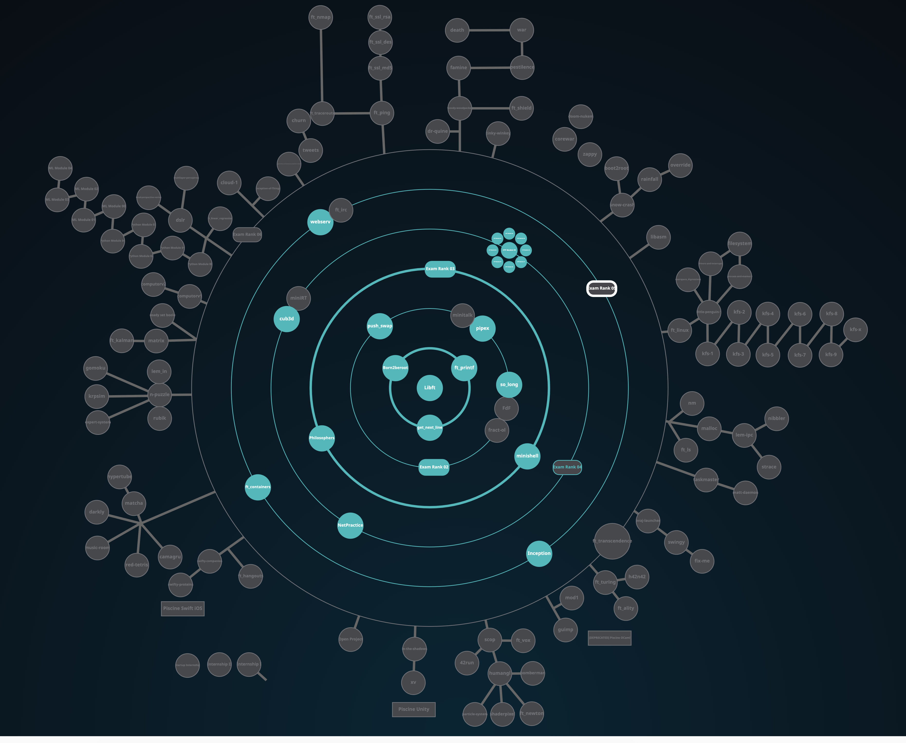

# 1337 - 42 NETWORK

## HolyGraph

## INFO
***CLASS OF 01/11/2021 (4th promo)***

## PROJECTS

### COMMON CORE

(***! some projects can't be uploaded due to there nature [virtual machine - networking - ... ]***)

(***! some projects only has 100 as max score***)

| CIRCLE  | NAME | FIELD | EXPECTED DURATION | EXP | STATUS | LVL |
| :-: | :-: | :-: | :-: | :-: | :-: | :-: |
| 0 | [libft](./LVL_0/libft) | C | 70 hours | 462 | [] | 1.05 |
| 1 | [get next line](./LVL_1/get_next_line) | C | 70 hours | 882 | []| 1.54 |
| 1 | [ft_printf](./LVL_1/ft_printf) | C | 175 hours | 882 | [] | 2.02 |
| 1 | Born2beRoot | Virtual Machine | 40 hours | 577 | []| 2.25 |
| 2 | [push_swap](./LVL_2/push_swap) | C | 60 hours | 1855 | [] | 2.97 |
| 2 | [so_long](./LVL_2/so_long) | C | 60 hours | 1000 | [] | 3.20 |
| 2 | [pipex](./LVL_2/pipex) | C | 50 hours | 1142 | [] | 3.44 |
| 3 | [philosophers](./LVL_3/philosophers) | C | 70 hours | 3360 | [] | 4.05 |
| 3 | [minishell](./LVL_3/minishell) | C | 210 hours | 2814 | [] | 4.25 |
| 4 | NetPractice | Networking | 50 hours | 3160 | [] | 4.43 |

